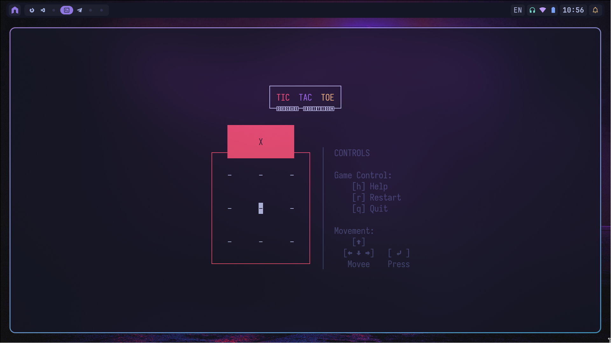

# Игра "Крестики-нолики"
Данная лабораторная работа реализует консольную версию игры **«Крестики-нолики»** на языке **C++**. 

## Требуемые библиотеки
Для корректной сборки и запуска необходимы следующие зависимости:
- `ncurses` (для консольного интерфейса);
- `UnitTest++` (для тестов).

## Сборка
```bash
# в корне проекта
mkdir -p build
cd build

cmake -S .. -B .
cmake --build .
```

## Запуск
```bash
# запуск игры
./bin/GameTicTacToe

# запуск тестов 
./bin/test_runner
```

## Скриншоты игры



